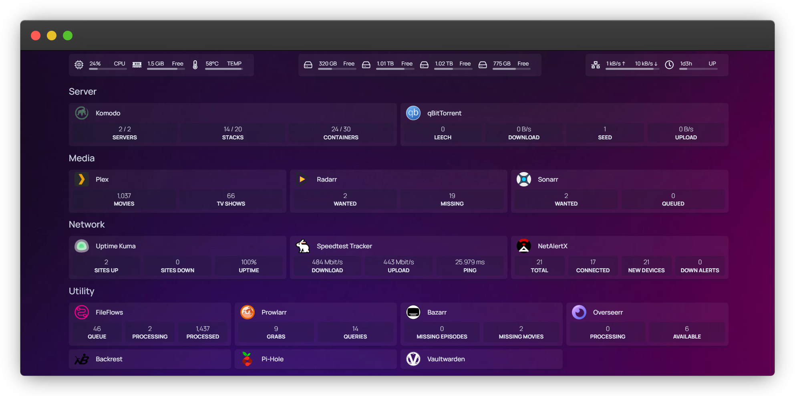

# Vault Homelab

This repository contains the [Docker Compose](https://docs.docker.com/compose/) configuration files for **Vault**, a self-hosted homelab environment managed with containerized services. The setup is designed for reliability and flexibility, leveraging [Komodo](https://github.com/moghtech/komodo) for container management and [Backrest](https://github.com/garethgeorge/backrest) for backups.

This setup allows for centralized management of media, monitoring, backups, and productivity tools for home use.

### 🖥️ System Specifications

- **OS:** Debian server ([debian:stable](https://www.debian.org/releases/stable/))
- **CPU:** 13th Gen Intel(R) Core(TM) i3-13100
- **RAM:** Corsair 8GB DDR4 @ 3200Mhz (Single Dimm)
- **Motherboard:** Gigabyte H610M H V2 DDR4
- **Network:** [Rocketnet](https://rocketnet.co.za/) 500mbps Upload/Download via [Metrofibre](https://metrofibre.co.za/)
- **Storage:** 
    - 1x 512GB Kimtigo NVME SSD
    - 2x 2TB Seagate HDD
    - 1x 4TB Western Digital HDD

---

### 📜 License

The Vault Homelab is provided under the MIT license.